# 🚀 Deployment Guide

> **Production deployment guide for the Multi-Agent E-Commerce Support System.**


---

## 📋 Table of Contents

- [Prerequisites](#prerequisites)
- [Deployment Options](#deployment-options)
- [Option 1: Cloud Run Deployment](#option-1-cloud-run-deployment-recommended)
- [Option 2: Vertex AI Agent Engine](#option-2-vertex-ai-agent-engine)
- [CI/CD Pipeline Setup](#cicd-pipeline-setup)
- [Environment Configuration](#environment-configuration)
- [Monitoring & Observability](#monitoring--observability)
- [Scaling Strategy](#scaling-strategy)
- [Troubleshooting](#troubleshooting)
- [Cost Optimization](#cost-optimization)

---

## Prerequisites

### Required Tools

```bash
# Google Cloud SDK
gcloud --version  # Must be >= 400.0.0

# Docker
docker --version  # Must be >= 24.0.0

# Python
python --version  # Must be >= 3.10
```

### Google Cloud Project Setup

```bash
# 1. Set your project ID
export PROJECT_ID="your-project-id"
gcloud config set project $PROJECT_ID

# 2. Enable required APIs
gcloud services enable \
    aiplatform.googleapis.com \
    run.googleapis.com \
    cloudbuild.googleapis.com \
    secretmanager.googleapis.com \
    sqladmin.googleapis.com \
    logging.googleapis.com \
    monitoring.googleapis.com

# 3. Create service account
gcloud iam service-accounts create ecommerce-agent-sa \
    --display-name="E-Commerce Agent Service Account"

# 4. Grant permissions
gcloud projects add-iam-policy-binding $PROJECT_ID \
    --member="serviceAccount:ecommerce-agent-sa@$PROJECT_ID.iam.gserviceaccount.com" \
    --role="roles/aiplatform.user"

gcloud projects add-iam-policy-binding $PROJECT_ID \
    --member="serviceAccount:ecommerce-agent-sa@$PROJECT_ID.iam.gserviceaccount.com" \
    --role="roles/logging.logWriter"
```

### Secrets Management

```bash
# Store Google API key securely
echo -n "your-google-api-key" | \
gcloud secrets create GOOGLE_API_KEY \
    --data-file=- \
    --replication-policy="automatic"

# Grant access to service account
gcloud secrets add-iam-policy-binding GOOGLE_API_KEY \
    --member="serviceAccount:ecommerce-agent-sa@$PROJECT_ID.iam.gserviceaccount.com" \
    --role="roles/secretmanager.secretAccessor"
```

---

## Deployment Options

### Comparison Matrix

| Feature | Cloud Run | Vertex AI Agent Engine |
|---------|-----------|------------------------|
| **Setup Complexity** | Low | Medium |
| **Customization** | High | Medium |
| **Auto-scaling** | ✅ Yes | ✅ Yes |
| **Cold Start** | ~2-3s | ~1-2s |
| **Cost** | Pay-per-use | Pay-per-use + storage |
| **State Management** | External (Cloud SQL) | Built-in sessions |
| **Best For** | Full control, custom backend | Quick deployment, managed |

---

## Option 1: Cloud Run Deployment (Recommended)

### Architecture

```mermaid
graph TD
    User[👤 User Request] --> LB[⚖️ Cloud Load Balancer]
    LB --> CR[🚀 Cloud Run Service]
    
    subgraph "Container Instance"
        CR --> API[FastAPI Backend]
        API --> Coord[🧠 Coordinator Agent]
    end
    
    Coord --> Gen[💬 General]
    Coord --> Prod[📦 Product]
    Coord --> Calc[🧮 Calc]
    
    Prod --> SQL[(🗄️ Cloud SQL)]
    Coord --> SQL
```



### Step 1: Prepare Application (Multi-Stage Dockerfile)

**Create `Dockerfile` (Optimized for Production):**

```dockerfile
# ---------------------------
# Stage 1: Builder
# ---------------------------
FROM python:3.11-slim as builder

WORKDIR /app

RUN apt-get update && apt-get install -y \
    gcc \
    g++ \
    && rm -rf /var/lib/apt/lists/*

COPY requirements.txt .
RUN pip install --user --no-cache-dir -r requirements.txt

# ---------------------------
# Stage 2: Runner (Lightweight)
# ---------------------------
FROM python:3.11-slim

WORKDIR /app

# Copy installed packages from builder
COPY --from=builder /root/.local /root/.local
ENV PATH=/root/.local/bin:$PATH

# Copy application code
COPY backend/ ./backend/

# Create non-root user for security
RUN useradd -m appuser && chown -R appuser /app
USER appuser

EXPOSE 8080

# Use Gunicorn for production performance
CMD ["gunicorn", "-k", "uvicorn.workers.UvicornWorker", "backend.main:app", "--bind", "0.0.0.0:8080", "--workers", "2", "--threads", "4"]
```

### Step 2: Build and Test Locally

```bash
# Build Docker image
docker build -t ecommerce-agent:latest .

# Test locally
docker run -p 8080:8080 \
  -e GOOGLE_API_KEY="your-api-key" \
  ecommerce-agent:latest
```

### Step 3: Deploy to Cloud Run

> **⚠️ CRITICAL WARNING:** Do NOT use SQLite in Cloud Run. Cloud Run is stateless; files are deleted when containers restart. **You must use Cloud SQL (PostgreSQL) for persistence.**

```bash
# Set region
export REGION="us-central1"

# Deploy service
gcloud run deploy ecommerce-agent-backend \
  --source . \
  --region $REGION \
  --platform managed \
  --allow-unauthenticated \
  --service-account ecommerce-agent-sa@$PROJECT_ID.iam.gserviceaccount.com \
  --set-env-vars "PROJECT_ID=$PROJECT_ID,ENVIRONMENT=production" \
  --set-secrets "GOOGLE_API_KEY=GOOGLE_API_KEY:latest" \
  --memory 2Gi \
  --cpu 2 \
  --min-instances 1 \
  --max-instances 10
```

### Step 4: Deploy Frontend (Streamlit)

**Create `frontend/Dockerfile`:**

```dockerfile
FROM python:3.11-slim
WORKDIR /app
COPY frontend/requirements.txt .
RUN pip install --no-cache-dir -r requirements.txt
COPY frontend/ .
EXPOSE 8501
CMD ["streamlit", "run", "Home.py", "--server.port=8501", "--server.address=0.0.0.0.0"]
```

**Deploy Frontend:**

```bash
gcloud run deploy ecommerce-agent-frontend \
  --source ./frontend \
  --region $REGION \
  --allow-unauthenticated \
  --set-env-vars "BACKEND_URL=https://YOUR_BACKEND_URL.run.app" \
  --memory 1Gi
```

---

## Option 2: Vertex AI Agent Engine

### Step 1: Deploy using Python SDK

```python
# deploy_to_agent_engine.py
from vertexai.preview import reasoning_engines
from google.adk.agents import Agent
import vertexai

vertexai.init(project="your-project-id", location="us-central1")

# Deploy to Agent Engine
deployed_agent = reasoning_engines.ReasoningEngine.create(
    coordinator,
    requirements=["google-adk==0.1.0", "google-generativeai==0.3.1"],
    display_name="ecommerce-support-agent-prod",
    sys_version="3.11"
)
```

---

## CI/CD Pipeline Setup

### GitHub Actions (`.github/workflows/deploy.yml`)

```yaml
name: Deploy to Cloud Run

on:
  push:
    branches: [ "main" ]

env:
  PROJECT_ID: ${{ secrets.GCP_PROJECT_ID }}
  REGION: us-central1
  SERVICE_NAME: ecommerce-agent-backend

jobs:
  deploy:
    runs-on: ubuntu-latest
    steps:
      - uses: actions/checkout@v3

      - name: Auth to GCP
        uses: google-github-actions/auth@v1
        with:
          credentials_json: ${{ secrets.GCP_SA_KEY }}

      - name: Deploy Backend
        run: |
          gcloud run deploy $SERVICE_NAME \
            --source . \
            --region $REGION \
            --platform managed \
            --allow-unauthenticated \
            --set-secrets "GOOGLE_API_KEY=GOOGLE_API_KEY:latest"
```

---

## Environment Configuration

### Environment Variables

**Production `.env` (Managed via Secret Manager):**

```bash
# API Keys
GOOGLE_API_KEY=secret:///projects/PROJECT_ID/secrets/GOOGLE_API_KEY

# Database (MUST BE CLOUD SQL for Prod)
DATABASE_URL=postgresql+psycopg2://user:pass@/ecommerce?host=/cloudsql/PROJECT_ID:REGION:INSTANCE

# Agent Config
AGENT_MODEL=gemini-2.0-flash-exp
LOG_LEVEL=INFO
```

---

## Monitoring & Observability

### Cloud Logging Setup

```python
import google.cloud.logging
client = google.cloud.logging.Client()
client.setup_logging()
```

### Custom Metrics Dashboard
Use **Cloud Monitoring** to visualize:
* `run.googleapis.com/request_count`
* `run.googleapis.com/request_latencies`

---

## Scaling Strategy

### Autoscaling Configuration

**Cloud Run behavior:**

| Traffic Pattern | Instances | Response Time |
| :--- | :--- | :--- |
| **Idle** | 1 (min) | Instant (No cold start) |
| **Normal** | 2-10 | 2-3s |
| **Peak** | 10-50 | Stable |

**Database Scaling:**
1.  **Dev:** SQLite (Local)
2.  **Prod:** Cloud SQL (PostgreSQL) - *Essential for preserving chat history.*

---

## Cost Optimization

| Traffic Level | Monthly Estimate |
| :--- | :--- |
| **Low (< 1k req/day)** | ~$20/mo |
| **Medium (10k req/day)** | ~$120/mo |
| **High (100k+ req/day)** | ~$400/mo |

**Tips:**
* Use `gemini-flash` instead of Pro for simple queries.
* Set `--min-instances 0` for non-critical dev environments to save costs.

---

**Maintained by:** Alvaro - AI Solutions Engineer
> *Last Updated: November 2025*
